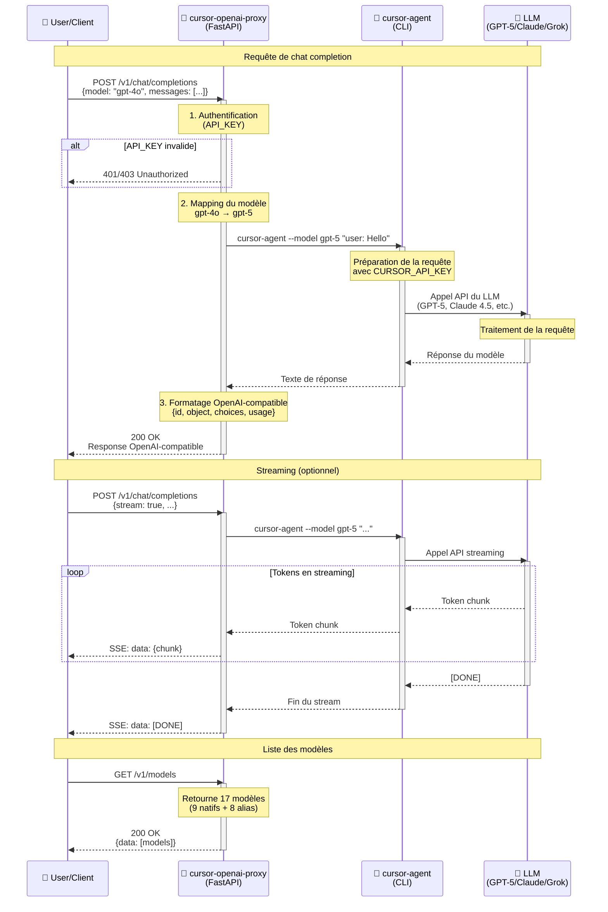

# Cursor Agent API Proxy

Proxy FastAPI pour cursor-agent compatible avec l'API OpenAI/ChatGPT.

## 🎯 Objectif

Ce projet permet d'exposer cursor-agent via une API REST compatible avec l'API OpenAI, permettant ainsi d'utiliser cursor-agent avec n'importe quel client compatible OpenAI (comme les bibliothèques `openai` en Python, JavaScript, etc.).

## 🏗️ Architecture

Le diagramme ci-dessous illustre le flux de communication entre les différents composants du système :



### Légende

- **User/Client** : Application utilisant le client OpenAI Python, JavaScript, ou requêtes curl
- **cursor-openai-proxy** : Serveur FastAPI qui expose l'API compatible OpenAI
  - Authentification via API_KEY
  - Mapping automatique des modèles (gpt-4o → gpt-5, claude-3-5-sonnet → sonnet-4.5)
  - Formatage des réponses au format OpenAI
- **cursor-agent** : CLI officiel de Cursor pour interagir avec les LLMs
  - Utilise CURSOR_API_KEY pour l'authentification
  - Supporte 9 modèles natifs : auto, composer-1, gpt-5, gpt-5-codex, sonnet-4.5, opus-4.1, grok, etc.
- **LLM** : Modèles de langage (GPT-5, Claude 4.5, Opus 4.1, Grok, etc.)

## 📋 Prérequis

- Python 3.8+
- [uv](https://github.com/astral-sh/uv) (gestionnaire de paquets moderne)
- [just](https://github.com/casey/just) (command runner moderne)
- cursor-agent installé et accessible

### Installer uv

```bash
# Sur macOS/Linux
curl -LsSf https://astral.sh/uv/install.sh | sh

# Ou avec Homebrew
brew install uv

# Ou avec pip
pip install uv
```

### Installer just

```bash
# Sur macOS/Linux
curl --proto '=https' --tlsv1.2 -sSf https://just.systems/install.sh | bash -s '--to ~/.local/bin'

# Ou avec Homebrew
brew install just

# Ou avec cargo
cargo install just
```

### Installer cursor-agent

**Pour développement local (mode CLI):**

```bash
# Installation officielle de cursor-agent
curl https://cursor.com/install -fsS | bash

# Vérifier l'installation
cursor-agent --version
# Devrait afficher: 2025.11.06-8fe8a63 (ou version similaire)

# Vérifier que cursor-agent est dans le PATH
which cursor-agent
# Devrait afficher: /Users/VOTRE_USER/.local/bin/cursor-agent
```

**Pour Docker:**
cursor-agent est automatiquement installé dans le conteneur Docker (voir `Dockerfile`). Aucune installation locale n'est requise si vous utilisez uniquement Docker.

**Alternative : Mode HTTP**
Si vous ne souhaitez pas installer cursor-agent localement, vous pouvez utiliser le mode HTTP en configurant `CURSOR_AGENT_MODE=http` dans `.env`. Dans ce cas, cursor-agent n'est pas nécessaire.

## 🚀 Installation

**Méthode recommandée (avec uv sync):**

```bash
# Crée automatiquement le venv et installe toutes les dépendances
uv sync
# ou
just install
```

**Méthode alternative:**

```bash
# Créer l'environnement virtuel
uv venv

# Activer l'environnement virtuel
source .venv/bin/activate  # Sur macOS/Linux
# ou
.venv\Scripts\activate  # Sur Windows

# Installer les dépendances
uv pip install -e .
```

## 💻 Utilisation

### Démarrer le serveur

**Avec just (recommandé pour les commandes):**

```bash
just dev     # Mode développement avec reload (port 8001)
just run     # Mode production (port 8001)
just start   # Démarrer en arrière-plan (daemon)
just stop    # Arrêter le serveur
just status  # Vérifier l'état du serveur
just logs    # Voir les logs en temps réel
just         # Voir toutes les commandes disponibles
```

**Avec uv (recommandé - pas besoin d'activer le venv):**

```bash
uv run python main.py
```

**Ou avec le script de démarrage:**

```bash
./run.sh
```

**Ou avec Docker:**

```bash
just docker-build
just docker-up
# ou
docker-compose up -d
```

**Ou directement avec Python après activation du venv:**

```bash
source .venv/bin/activate
python main.py
```

**Ou avec uvicorn directement:**

```bash
uv run uvicorn main:app --host 0.0.0.0 --port 8001 --reload
```

Le serveur sera accessible sur `http://localhost:8001` (local) ou `http://localhost:8002` (Docker tests)

### Documentation API

Une fois le serveur démarré, accédez à:
- Swagger UI: `http://localhost:8001/docs`
- ReDoc: `http://localhost:8001/redoc`

Ou utilisez:
```bash
just docs  # Ouvre automatiquement la documentation dans le navigateur
```

### Collection Postman

Une collection Postman complète est disponible pour tester l'API :
- Fichier : `postman/Cursor-API-Proxy.postman_collection.json`
- Environnement : `postman/Local.postman_environment.json`
- Documentation : `postman/README.md`

**Import dans Postman :**
1. Ouvrez Postman
2. Cliquez sur **Import**
3. Sélectionnez `postman/Cursor-API-Proxy.postman_collection.json`
4. (Optionnel) Importez aussi `postman/Local.postman_environment.json`
5. Configurez la variable `api_key` si l'authentification est activée

## 🤖 Modèles supportés

Le proxy supporte tous les modèles disponibles dans cursor-agent et mappe automatiquement les noms de modèles OpenAI/Anthropic populaires.

### Modèles natifs cursor-agent

| Modèle | Description |
|--------|-------------|
| `default` | Modèle par défaut de cursor-agent (recommandé) |
| `gpt-5` | GPT-5 d'OpenAI |
| `sonnet-4` | Claude Sonnet 4 d'Anthropic |
| `sonnet-4-thinking` | Claude Sonnet 4 avec mode thinking |

### Alias OpenAI (mappés automatiquement)

Les noms de modèles OpenAI populaires sont automatiquement mappés vers `gpt-5` :

| Alias OpenAI | Mappé vers |
|--------------|------------|
| `gpt-4o` | `gpt-5` |
| `gpt-4o-mini` | `gpt-5` |
| `gpt-4-turbo` | `gpt-5` |
| `gpt-4` | `gpt-5` |
| `gpt-3.5-turbo` | `gpt-5` |

### Alias Anthropic (mappés automatiquement)

| Alias Anthropic | Mappé vers |
|-----------------|------------|
| `claude-3-5-sonnet-20241022` | `sonnet-4` |
| `claude-sonnet-4` | `sonnet-4` |
| `claude-sonnet-4.0` | `sonnet-4` |

### Exemples d'utilisation

```python
from openai import OpenAI
import os
from dotenv import load_dotenv

load_dotenv()
client = OpenAI(
    base_url="http://localhost:8001/v1",
    api_key=os.getenv("API_KEY")
)

# Utiliser GPT-5 avec un nom OpenAI (mappé automatiquement)
response = client.chat.completions.create(
    model="gpt-4o",  # Sera mappé vers gpt-5
    messages=[{"role": "user", "content": "Hello"}]
)

# Utiliser Claude Sonnet 4 avec un nom Anthropic
response = client.chat.completions.create(
    model="claude-3-5-sonnet-20241022",  # Sera mappé vers sonnet-4
    messages=[{"role": "user", "content": "Hello"}]
)

# Utiliser directement un nom cursor-agent
response = client.chat.completions.create(
    model="gpt-5",  # Nom natif cursor-agent
    messages=[{"role": "user", "content": "Hello"}]
)

# Utiliser le modèle par défaut
response = client.chat.completions.create(
    model="default",  # Laisse cursor-agent choisir
    messages=[{"role": "user", "content": "Hello"}]
)
```

### Liste des modèles disponibles

Pour obtenir la liste complète des modèles supportés :

```bash
curl http://localhost:8001/v1/models
```

Ou en Python :

```python
models = client.models.list()
for model in models.data:
    print(f"- {model.id} (owned by {model.owned_by})")
```

## 📡 API Endpoints

### POST `/v1/chat/completions`

Endpoint principal compatible avec l'API OpenAI.

**Requête:**
```json
{
  "model": "gpt-4o",
  "messages": [
    {"role": "system", "content": "Tu es un assistant utile."},
    {"role": "user", "content": "Bonjour, comment ça va?"}
  ],
  "temperature": 0.7,
  "max_tokens": 1000
}
```

**Réponse:**
```json
{
  "id": "chatcmpl-abc123",
  "object": "chat.completion",
  "created": 1234567890,
  "model": "gpt-4o",
  "choices": [
    {
      "index": 0,
      "message": {
        "role": "assistant",
        "content": "Réponse de cursor-agent..."
      },
      "finish_reason": "stop"
    }
  ],
  "usage": {
    "prompt_tokens": 10,
    "completion_tokens": 20,
    "total_tokens": 30
  }
}
```

### POST `/v1/chat/completions-stream`

Endpoint pour le streaming (Server-Sent Events).

### GET `/v1/models`

Liste les modèles disponibles.

### GET `/health`

Vérification de santé du service.

## ⚙️ Configuration

### Configuration du fichier .env

**Méthode rapide (interactive):**

```bash
just setup-env
# ou
./scripts/setup-env.sh
```

**Méthode manuelle:**

```bash
# Copier le fichier d'exemple
cp .env.example .env

# Éditer avec votre éditeur préféré
nano .env
# ou
code .env
```

**Variables essentielles à configurer:**

1. **Mode cursor-agent** (`CURSOR_AGENT_MODE`):
   - `cli` : Utilise cursor-agent en ligne de commande
   - `http` : Appelle une API HTTP cursor-agent
   - `library` : Utilise cursor-agent comme bibliothèque Python

2. **Selon le mode choisi:**
   - **CLI**: `CURSOR_AGENT_CLI_PATH` (chemin vers l'exécutable)
   - **HTTP**: `CURSOR_AGENT_HTTP_URL` (URL de l'API)

3. **Sécurité (production):**
   - `API_KEY` : Clé API pour protéger VOTRE API proxy (générée par vous, pas liée à cursor-agent)
   
   ⚠️ **Important:** `API_KEY` protège votre API proxy, pas cursor-agent. Si cursor-agent nécessite une authentification, voir [SECURITY.md](doc/SECURITY.md).

Voir [CONFIGURATION.md](doc/CONFIGURATION.md) pour le guide complet de configuration et [INTEGRATION.md](doc/INTEGRATION.md) pour les détails sur l'intégration avec cursor-agent.

### Adapter l'appel à cursor-agent

Dans le fichier `main.py`, les fonctions d'intégration peuvent être adaptées:
- `_call_cursor_agent_cli()` - pour le mode CLI
- `_call_cursor_agent_http()` - pour le mode HTTP  
- `_call_cursor_agent_library()` - pour le mode Library

Voir [INTEGRATION.md](doc/INTEGRATION.md) pour les détails.

## 🔧 Exemple d'utilisation avec le client OpenAI Python

Installer le client OpenAI pour les exemples:

```bash
uv sync --extra examples
# ou
uv pip install openai
```

Puis utiliser:

```python
from openai import OpenAI
import os
from dotenv import load_dotenv

# Charger les variables d'environnement depuis .env
load_dotenv()

# Configurer le client pour pointer vers votre proxy
client = OpenAI(
    base_url="http://localhost:8001/v1",  # Port 8001 pour le développement local
    api_key=os.getenv("API_KEY")  # API key pour l'authentification
)

# Utiliser comme avec OpenAI
response = client.chat.completions.create(
    model="cursor-agent",
    messages=[
        {"role": "user", "content": "Bonjour!"}
    ]
)

print(response.choices[0].message.content)
```

Exécuter l'exemple:

```bash
just example
# ou
uv run python example_usage.py
```

## 🔒 Sécurité

Pour la production, ajoutez:
- Authentification (API keys) - configuré via `API_KEY` dans `.env`
- Rate limiting - middleware disponible (décommenter dans `main.py`)
- Validation supplémentaire des entrées
- Logging et monitoring
- HTTPS/TLS

Voir [DEPLOYMENT.md](doc/DEPLOYMENT.md) pour les détails sur le déploiement sécurisé.

## 🧪 Tests

Ce projet dispose d'une architecture de tests complète à plusieurs niveaux :

### Tests unitaires

Tests rapides des composants individuels (config, endpoints, middlewares) :

```bash
just test              # Exécuter tous les tests unitaires
just test-cov          # Avec rapport de couverture
just test-watch        # Mode watch (redémarre automatiquement)
```

Fichiers : `tests/test_api.py`, `tests/test_config.py`

### Tests d'intégration - Niveau 1 : Python local (port 8001)

Tests rapides qui lancent automatiquement le serveur FastAPI en Python :

```bash
just test-integration-local
```

**Caractéristiques :**
- ✅ Lance/arrête automatiquement le serveur FastAPI
- ✅ Vérifie qu'aucun serveur n'est déjà sur le port 8001
- ✅ Utilise le client OpenAI Python officiel
- ✅ Tests d'authentification, modèles, chat, conversations
- ⚡ **Rapide** : ~21 secondes
- 🎯 **Usage** : Développement quotidien, CI/CD rapide

Fichier : `tests/test_integration_local.py`

### Tests d'intégration - Niveau 2 : Docker (port 8002)

Tests complets qui lancent automatiquement Docker Compose :

```bash
just test-integration-docker
```

**Caractéristiques :**
- ✅ Lance/arrête automatiquement Docker Compose
- ✅ Vérifie qu'aucun conteneur n'est déjà sur le port 8002
- ✅ Tests spécifiques Docker : cursor-agent installé, env vars, stabilité
- ✅ Valide l'environnement de production complet
- 🐳 **Complet** : ~39 secondes
- 🎯 **Usage** : Validation avant release, CI/CD production

Fichier : `tests/test_integration_docker.py`

Configuration Docker de test : `docker-compose.test.yml`

### Tests d'intégration - Bash/curl

Tests manuels avec curl (nécessite un serveur déjà lancé) :

```bash
just test-integration-curl
```

Fichier : `scripts/test_integration.sh`

### Lancer tous les tests

```bash
# Tous les tests d'intégration (local + docker)
just test-integration-all

# TOUS les tests (unitaires + intégration complète)
just test-all
```

### Séparation des ports

Pour éviter les conflits et clarifier ce qui est testé :

- **Port 8001** : Python local (dev + tests locaux)
- **Port 8002** : Docker (tests uniquement)

### Architecture des tests

```
tests/
├── test_api.py                    # Tests unitaires des endpoints
├── test_config.py                 # Tests unitaires de la configuration
├── test_integration_local.py      # Tests d'intégration Python (8001)
├── test_integration_docker.py     # Tests d'intégration Docker (8002)
└── test_integration_openai.py     # Tests génériques OpenAI (ancien)

scripts/
└── test_integration.sh            # Tests bash/curl

docker-compose.test.yml            # Configuration Docker pour les tests
```

### Workflow recommandé

**Pendant le développement :**
```bash
just test-integration-local  # Rapide, teste le code Python
```

**Avant un commit/push :**
```bash
just test-all  # Tout : unitaires + local + docker
```

**En CI/CD :**
```bash
# Tests rapides pour chaque commit
just test-integration-local

# Tests complets pour main/release
just test-integration-docker
```

## 📝 Notes

- Le comptage de tokens est approximatif (1 token ≈ 4 caractères)
- Pour un comptage précis, intégrez `tiktoken` ou une bibliothèque similaire
- Le streaming est simulé - adaptez selon les capacités réelles de cursor-agent

## 🛠️ Commandes utiles (avec just)

```bash
# Voir toutes les commandes disponibles
just

# Installation et développement
just install          # Installer les dépendances
just dev              # Mode développement avec reload
just run              # Mode production

# Tests
just test                      # Tests unitaires uniquement
just test-cov                  # Tests unitaires avec couverture
just test-integration-local    # Tests d'intégration Python (port 8001, rapide)
just test-integration-docker   # Tests d'intégration Docker (port 8002, complet)
just test-integration-all      # Tous les tests d'intégration
just test-all                  # TOUS les tests (unitaires + intégration)

# Qualité de code
just format           # Formater le code
just lint             # Vérifier le code
just check            # Format + lint

# Docker
just docker-build     # Construire l'image Docker
just docker-up        # Démarrer avec Docker Compose
just docker-down      # Arrêter Docker Compose
just docker-logs      # Voir les logs

# Utilitaires
just clean            # Nettoyer les fichiers générés
just info             # Informations sur l'environnement
just example          # Exécuter l'exemple
just health           # Vérifier la santé du serveur
just docs             # Ouvrir la documentation
```

## 📚 Documentation complémentaire

- [Guide de démarrage rapide](doc/QUICK_START.md) - Démarrage en 5 minutes
- [Guide de configuration](doc/CONFIGURATION.md) - Configuration détaillée du .env
- [Guide d'intégration](doc/INTEGRATION.md) - Comment intégrer avec cursor-agent
- [Guide de sécurité](doc/SECURITY.md) - Authentification et sécurité
- [Guide de déploiement](doc/DEPLOYMENT.md) - Déploiement en production
- [Guide Docker](doc/DOCKER_USAGE.md) - Utilisation avec Docker
- [Prochaines étapes](doc/NEXT_STEPS.md) - Checklist et améliorations
- [Points à améliorer](doc/AMELIORATIONS.md) - Améliorations suggérées

## 🤝 Contribution

Les contributions sont les bienvenues! N'hésitez pas à ouvrir une issue ou une pull request.

## 📄 Licence

MIT
